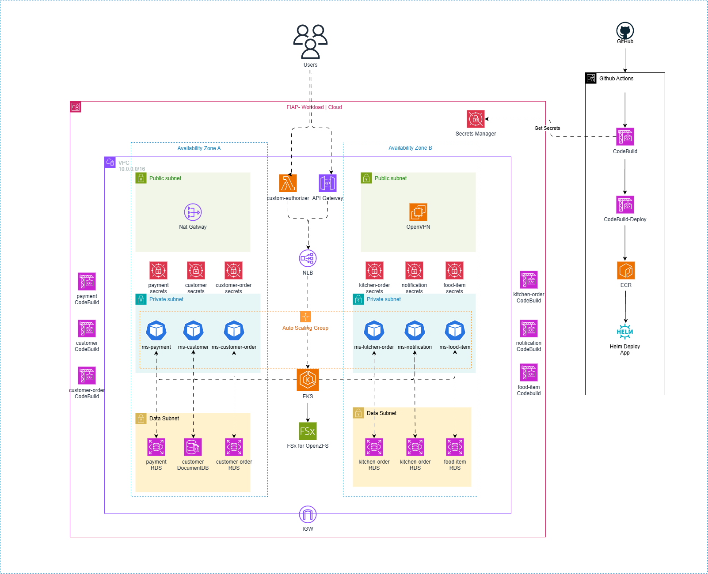

[](https://github.com/11soat-f3-lanches-caieiras/lncr-iac/actions/workflows/infra-base.yml)

# 🏗️ Lanches Caieiras Infrastructure as Code (IaC)

Este repositório contém a infraestrutura completa como código para o projeto Lanches Caieiras (lncr), implementando uma arquitetura moderna e escalável na AWS usando Terraform. A solução inclui VPC, EKS, OpenVPN, API Gateway, ECR, CodeBuild e outros serviços essenciais.

> **📚 Contexto Acadêmico**: Este repositório faz parte dos entregáveis do trabalho da **Fase 3** do curso de **Pós-graduação em Software Architecture** da **FIAP**, demonstrando a aplicação prática de conceitos de arquitetura de software, infraestrutura como código e DevOps em um ambiente cloud-native.

## 📋 Índice

- [Visão Geral da Arquitetura](#-visão-geral-da-arquitetura)
- [Recursos Provisionados](#-recursos-provisionados)
- [Estrutura do Projeto](#-estrutura-do-projeto)
- [Pré-requisitos](#-pré-requisitos)
- [Início Rápido](#-início-rápido)
- [Workflows CI/CD](#-workflows-cicd)
- [Módulos Detalhados](#-módulos-detalhados)
- [Variáveis de Configuração](#-variáveis-de-configuração)
- [Outputs](#-outputs)
- [Segurança](#-segurança)
- [Monitoramento](#-monitoramento)
- [Troubleshooting](#-troubleshooting)
- [Contribuição](#-contribuição)

## 🏛️ Visão Geral da Arquitetura

A infraestrutura foi projetada seguindo as melhores práticas de segurança e escalabilidade:

[](https://viewer.diagrams.net/?tags=%7B%7D&lightbox=1&highlight=0000ff&edit=_blank&layers=1&nav=1&title=Diagrama%20de%20Infraestrutura.drawio&dark=auto#Uhttps%3A%2F%2Fdrive.google.com%2Fuc%3Fid%3D1rKZRqcxGfWoqetAgKH6eO4vvN72eppjw%26export%3Ddownload)


## 🚀 Recursos Provisionados

### Infraestrutura de Rede
- **VPC** com subnets públicas, privadas e de dados
- **Internet Gateway** e **NAT Gateways**
- **Route Tables** e associações
- **Security Groups** com regras específicas
- **VPC Endpoints** para S3

### Compute e Container
- **EKS Cluster** (Kubernetes 1.33) com managed node groups
- **EC2 Instance** para OpenVPN Server
- **Lambda Functions** para custom authorizer
- **ALB Controller** para load balancing

### Storage e Dados
- **ECR Repositories** para imagens Docker
- **FSx OpenZFS** para storage compartilhado
- **S3 Buckets** para artefatos e certificados

### CI/CD e DevOps
- **CodeBuild Projects** para automação
- **GitHub Actions** workflows
- **Secrets Manager** para credenciais

### API e Networking
- **API Gateway HTTP v2** com CORS e throttling
- **VPC Links** para integração privada
- **Custom Authorizer** com Lambda

### Monitoramento
- **CloudWatch Log Groups** para logs
- **KMS Keys** para criptografia
- **IAM Roles e Policies** para segurança

## 📁 Estrutura do Projeto

```
lncr-iac/
├── .github/
│   └── workflows/              # GitHub Actions workflows
│       ├── bootstrap.yml       # Deploy inicial (VPC + CodeBuild)
│       ├── infra-base.yml      # Deploy base infrastructure
│       └── infra-complete.yml  # Deploy completo com API Gateway
├── modules/                    # Módulos Terraform reutilizáveis
│   ├── vpc/                   # Infraestrutura de rede
│   ├── eks/                   # Cluster Kubernetes
│   ├── openvpn/               # Servidor VPN
│   ├── api-gateway/           # API Gateway HTTP v2
│   ├── ecr/                   # Container Registry
│   ├── codebuild/             # CI/CD Projects
│   ├── lambda/                # Functions serverless
│   ├── alb-controller/        # Load Balancer Controller
│   ├── secrets-manager/       # Gerenciamento de segredos
│   └── fsx-openzfs/          # Storage compartilhado
├── main.tf                    # Configuração principal
├── variables.tf               # Definições de variáveis
├── locals.tf                  # Valores locais
├── providers.tf               # Configuração de providers
├── prd.tfvars                # Variáveis do ambiente produção
└── README.md                  # Esta documentação
```


## 🔄 Workflows CI/CD

### Bootstrap Workflow
**Arquivo**: `.github/workflows/bootstrap.yml`
- **Trigger**: Manual (workflow_dispatch)
- **Função**: Deploy inicial da VPC e CodeBuild
- **Uso**: Primeira execução para criar infraestrutura base

### Infra Base Workflow
**Arquivo**: `.github/workflows/infra-base.yml`
- **Trigger**: Push para branch `develop` ou manual
- **Recursos**: VPC, EKS, ECR, Secrets Manager, FSx, OpenVPN, Lambda
- **Runner**: CodeBuild personalizado
- **Integração**: Dispara deploys em outros repositórios

### Infra Complete Workflow
**Arquivo**: `.github/workflows/infra-complete.yml`
- **Trigger**: Push para `develop`, repository_dispatch ou manual
- **Recursos**: API Gateway com integrações NLB e Lambda
- **Dependências**: Requer infraestrutura base já implantada

### Configuração de Secrets
Configure os seguintes secrets no GitHub:
```
AWS_ACCESS_KEY_ID       # Chave de acesso AWS
AWS_SECRET_ACCESS_KEY   # Chave secreta AWS
REPO_TOKEN             # Token para disparar workflows em outros repos
```

## 📦 Módulos Detalhados

### Módulo VPC (`modules/vpc/`)
**Recursos Criados:**
- VPC com CIDR configurável
- Subnets públicas, privadas (app) e de dados
- Internet Gateway e NAT Gateways
- Route Tables e associações
- Security Groups
- VPC Endpoints (S3)
- DB Subnet Groups

**Características:**
- Suporte a múltiplas AZs
- IPv6 opcional
- NAT Gateway com HA opcional
- Tags para EKS e Karpenter

### Módulo EKS (`modules/eks/`)
**Recursos Criados:**
- EKS Cluster com versão configurável
- Managed Node Groups
- Security Groups específicos
- IAM Roles e Policies
- KMS Key para criptografia
- Storage Classes (GP3)
- Namespaces customizados
- AWS Auth ConfigMap

**Add-ons Inclusos:**
- kube-proxy
- eks-pod-identity-agent
- vpc-cni
- aws-ebs-csi-driver
- coredns

### Módulo OpenVPN (`modules/openvpn/`)
**Recursos Criados:**
- EC2 Instance com OpenVPN Access Server
- Security Group (portas 8080/TCP, 1194/UDP)
- IAM Role com políticas S3 e SSM
- Key Pair para acesso SSH
- S3 Bucket para certificados
- Secrets Manager para credenciais
- User Data script para configuração

### Módulo API Gateway (`modules/api-gateway/`)
**Recursos Criados:**
- API Gateway HTTP v2
- Stage padrão com auto-deploy
- CORS configuration
- Throttling settings
- VPC Link para EKS
- Custom Authorizer com Lambda
- CloudWatch Log Groups
- Rotas protegidas e abertas

### Módulo ECR (`modules/ecr/`)
**Recursos Criados:**
- Repositórios ECR
- Lifecycle policies
- Image scanning
- Tag mutability settings

### Módulo CodeBuild (`modules/codebuild/`)
**Recursos Criados:**
- Projetos CodeBuild
- IAM Roles e Policies
- Security Groups
- VPC Configuration
- GitHub Webhooks
- GitHub Actions Runners

### Módulo Lambda (`modules/lambda/`)
**Recursos Criados:**
- Lambda Functions
- IAM Roles
- Environment Variables
- Deployment Packages

### Módulo ALB Controller (`modules/alb-controller/`)
**Recursos Criados:**
- Helm Release para AWS Load Balancer Controller
- Service Account com IRSA
- IAM Roles e Policies
- Kubernetes Namespace

### Módulo Secrets Manager (`modules/secrets-manager/`)
**Recursos Criados:**
- Secrets para aplicações
- Recovery window configurável
- Tags padronizadas

### Módulo FSx OpenZFS (`modules/fsx-openzfs/`)
**Recursos Criados:**
- FSx OpenZFS File System
- Security Groups
- Backup configuration
- Performance settings


## 📤 Outputs

### Outputs Principais
```hcl
# VPC
vpc_id                    # ID da VPC
public_subnet_ids         # IDs das subnets públicas
app_subnet_ids           # IDs das subnets privadas
data_subnet_ids          # IDs das subnets de dados

# EKS
cluster_name             # Nome do cluster EKS
cluster_endpoint         # Endpoint do cluster
cluster_security_group_id # ID do security group
oidc_provider_arn        # ARN do OIDC provider

# API Gateway
api_gateway_id           # ID do API Gateway
api_gateway_endpoint     # Endpoint da API
api_execution_arn        # ARN de execução

# ECR
ecr_repository_urls      # URLs dos repositórios ECR

# CodeBuild
codebuild_project_names  # Nomes dos projetos CodeBuild
```

## 🔒 Segurança

### Práticas Implementadas

#### Rede
- **Isolamento**: Subnets separadas por função (pública, privada, dados)
- **NAT Gateway**: Acesso internet controlado para subnets privadas
- **Security Groups**: Regras restritivas de ingress/egress
- **VPC Endpoints**: Comunicação privada com serviços AWS

#### Identidade e Acesso
- **IAM Roles**: Princípio do menor privilégio
- **IRSA**: Service Accounts com roles específicas
- **Custom Authorizer**: Autenticação/autorização customizada
- **Secrets Manager**: Armazenamento seguro de credenciais

#### Criptografia
- **KMS**: Chaves gerenciadas para EKS
- **EBS Encryption**: Volumes criptografados
- **S3 Encryption**: Buckets com criptografia
- **TLS**: Comunicação criptografada

#### Monitoramento
- **CloudWatch Logs**: Logs centralizados
- **VPC Flow Logs**: Monitoramento de tráfego de rede
- **API Gateway Logs**: Logs de requisições
- **EKS Audit Logs**: Logs de auditoria Kubernetes

